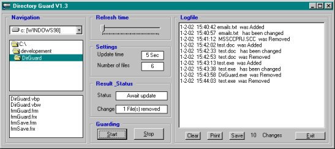



## DirGuard V1\.4

### Description

This program guards a given directory, its an update of a previous version.

I have added the detection of filechanges (suggested by TonyK), completed the print-code, savecode for the log and put lost of comments in the code.

The code is more complex than the previous version but does not contain API, classes or DLL so it should be easy to read.

I did not yet found a simple way to obtain the username of the person who does the altering of files (suggested by Maju) but i am working on it.

This can result in a bit of API but who knows there might be a simple way.

Tested with WIN95/98/SE and WIN-NT.

Please RATE this program and feel free to send me suggestions / questions.

Cybsoft
 
### More Info
 
None known

             |
---                |---
**Submitted On**   |2002-02-01 15:50:14
**By**             |[Cybsoft](https://github.com/Planet-Source-Code/PSCIndex/blob/master/ByAuthor/cybsoft.md)
**Level**          |Beginner
**User Rating**    |4.7 (14 globes from 3 users)
**Compatibility**  |VB 5\.0, VB 6\.0
**Category**       |[Files/ File Controls/ Input/ Output](https://github.com/Planet-Source-Code/PSCIndex/blob/master/ByCategory/files-file-controls-input-output__1-3.md)
**World**          |[Visual Basic](https://github.com/Planet-Source-Code/PSCIndex/blob/master/ByWorld/visual-basic.md)
**Archive File**   |[DirGuard\_V52238212002\.zip](https://github.com/Planet-Source-Code/cybsoft-dirguard-v1-4__1-31380/archive/master.zip)

